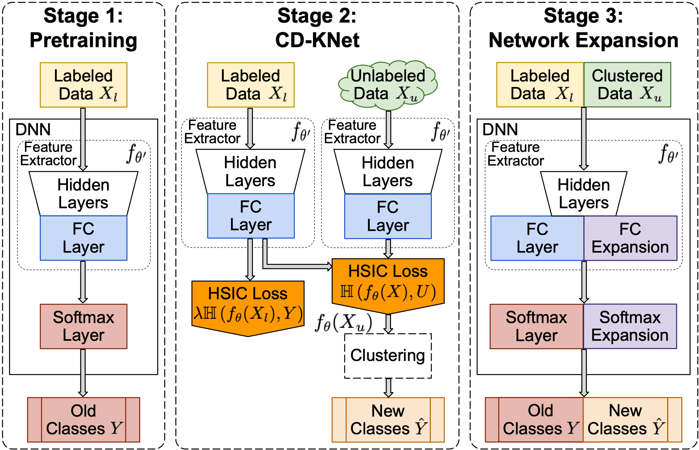

# Open-World Class Discovery with Kernel Networks

This repo contains code and necessary files to reproduce the result in the paper, [*Open-World Class Discovery with Kernel Networks*](https://www.computer.org/csdl/proceedings-article/icdm/2020/831600a631/1r54HgwR0sw) ([Arxiv version](https://arxiv.org/pdf/2012.06957.pdf)).


## Abstract


We study an Open-World Class Discovery problem in which, given labeled training samples from old classes, we need to discover new classes from unlabeled test samples. There are two critical challenges to addressing this paradigm: (a) transferring knowledge from old to new classes, and (b) incorporating knowledge learned from new classes back to the original model. We propose Class Discovery Kernel Network with Expansion (CD-KNet-Exp), a deep learning framework, which utilizes the Hilbert Schmidt Independence Criterion to bridge supervised and unsupervised information together in a systematic way, such that the learned knowledge from old classes is distilled appropriately for discovering new classes. Compared to competing methods, CD-KNet-Exp shows superior performance on three publicly available benchmark datasets and a challenging real-world radio frequency fingerprinting dataset.


## Usage

Please refer to [mnist_hsic_semi.py](./mnist_hsic_semi.py) for basic usage of our code. The arguments in the code are self-explanatory: users can specify the split of old and new classes as well as hyperparameters for learning.

## Citing the paper
```
@INPROCEEDINGS {9338431,
author = {Z. Wang and B. Salehi and A. Gritsenko and K. Chowdhury and S. Ioannidis and J. Dy},
booktitle = {2020 IEEE International Conference on Data Mining (ICDM)},
title = {Open-World Class Discovery with Kernel Networks},
year = {2020},
volume = {},
issn = {},
pages = {631-640},
keywords = {training;knowledge engineering;deep learning;systematics;fingerprint recognition;benchmark testing;kernel},
doi = {10.1109/ICDM50108.2020.00072},
url = {https://doi.ieeecomputersociety.org/10.1109/ICDM50108.2020.00072},
publisher = {IEEE Computer Society},
address = {Los Alamitos, CA, USA},
month = {nov}
}

```


## Contributing
Pull requests are welcome. For major changes, please open an issue first to discuss what you would like to change.

Please make sure to update tests as appropriate.

## License
[MIT](https://choosealicense.com/licenses/mit/)

